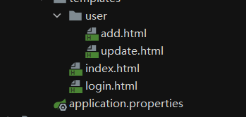
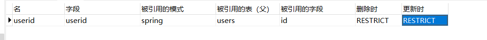

## SpringBoot-Shiro的使用方法

1.首先我们需要引入Spring-Shiro整合的依赖包

```xml
shiro-spring整合包-->
        <dependency>
            <groupId>org.apache.shiro</groupId>
            <artifactId>shiro-spring</artifactId>
            <version>1.9.0</version>

```

2.然后我们需要简单的搭建一个网页



3.编写网页间路由，代码都在Controller就不粘贴了

4.实现权限拦截与登录验证

* 4.1 我们首先需要在Shiro配置类中我们需要创建三个bean交给Spring来管理，这三个bean就是来进行Shiro的权限拦截，他会判断用户当前是否有设置的权限来控制用户是继续操作还是跳回登录页面。
  这三个bean分别为：xxxRealm，DefaultWebSecurityManager(需要setRealm)，ShiroFilterFactoryBean(需要setDefaultWebSecurityManager)，下一级的bean需要使用上一级的bean作为参数来注入自己的类属性，ShiroFilterFactoryBean这个bean则是我们设置权限验证与登录跳转的类，它可以通过LinkedHashMap来设置需要拦截的url以及设置setLoginUrl()来设置失败后跳转的页面。

```java
/**
 * 作为一个配置类，用来配置Shiro的一些必要的信息,使用配置类一定不要忘了添加注解
 * @author planifolia
 */
@Configuration
public class ShiroConfig {
    /**
     * ShiroFilterFactoryBean,需要shiroWebSecurityManager是它必须要设定的属性值,赋值完毕之后交给Spring处理<br>
     * 设置应用程序 SecurityManager 实例以供构造的 Shiro 过滤器使用。这是一个必需的属性
     * - 设置失败将引发初始化异常。
     */
    @Bean
    public ShiroFilterFactoryBean shiroFilterFactoryBean(@Qualifier("defaultWebSecurityManager") DefaultWebSecurityManager defaultWebSecurityManager){
        ShiroFilterFactoryBean bean=new ShiroFilterFactoryBean();
        bean.setSecurityManager(defaultWebSecurityManager);
        /**
         * tip：用户权限的类型
         * 1.anon，任何人
         * 2.authc，需要认证了
         * 3.user，需要记住我
         * 4.perms，需要拥有某个资源
         * 5.role，需要拥有某个角色
         */
        //我们在这里面进行用户的拦截
        //创建拦截的url以及对应的权限用户，用map来保存
        Map<String,String> filterMap=new LinkedHashMap<>();
        //设定user下的网页只有认证之后才能访问
        filterMap.put("/toupdate","authc");
        filterMap.put("/toadd","authc");
        //将属性放到ShiroFilterFactoryBean中
        bean.setFilterChainDefinitionMap(filterMap);
        bean.setLoginUrl("/toLogin");
        return bean;
    }
    /**
     * DefaultWebSecurityManager,它需要UserRealm作为参数，然后再将它当作bean交给Spring
     */
    @Bean
    public DefaultWebSecurityManager defaultWebSecurityManager(@Qualifier("userRealm") UserRealm userRealm){
        DefaultWebSecurityManager bean=new DefaultWebSecurityManager();
        bean.setRealm(userRealm);
        return bean;

    }
    /**
     * realm对象，只需要返回一个bean对象交给Spring容器就可以了
     */
    @Bean
    public UserRealm userRealm(){
        return new UserRealm();
    }
}


```

* 4.2 我们编写好配置类之后要开始编写处理登录信息的Controller,这个Controller会接收到前端的用户登录表单然后封装成token提交给shiro来进行下一步的处理

```java
    /**
     * 使用shiro来进行登陆验证的Controller
     * @param username
     * @param password
     * @param model
     * @return
     */
    @RequestMapping("/login")
    public String login(String username, String password, Model model){
        //获取当前用户
        Subject subject= SecurityUtils.getSubject();
        //封装用户的登录信息,令牌
        UsernamePasswordToken token=new UsernamePasswordToken(username,password);
        /*执行当前用户的登录操作，执行到这里之后shiro会交给UserRealm来完成剩下的验证操作，
        我们可以通过处理异常来给前端传递一些消息
        */
        try {
            subject.login(token);
            return "index";
        }catch (UnknownAccountException unknownAccountException){//处理用户不存在异常
            model.addAttribute("msg","用户名不存在！");
            return "/login";
        }catch (IncorrectCredentialsException incorrectCredentialsException){//处理密码不正确异常
            model.addAttribute("msg","用户密码错误！");
            return "login";
        }
```

* 4.3 当controller将信息封装好并且交给shiro之后我们就要开始编写xxxRealm类了，这个类会根据提交过来的token来进行验证，根据我们编写的代码以及调用shiro里面的验证密码的方法来返回不同的异常，这个异常就需要我们在controller中处理

```java

/**
 * @author 14431
 */
public class UserRealm extends AuthorizingRealm {
    /**
     * 授权
     */
    @Override
    protected AuthorizationInfo doGetAuthorizationInfo(PrincipalCollection principalCollection) {
        System.out.println("Shiro授权方法执行");
        return null;
    }

    /**
     * 认证
     */
    @Override
    protected AuthenticationInfo doGetAuthenticationInfo(AuthenticationToken authenticationToken) throws AuthenticationException {
        System.out.println("Shiro认证方法执行");
        String name="user";
        String pass="001";
        //拿到controller送过来的token并且强转型
        UsernamePasswordToken token=(UsernamePasswordToken) authenticationToken;
        //如果token的用户名与我们的不一致则返回null
        if(!token.getUsername().equals(name)){
            return null;
        }
        //密码认证，只能交给shiro来做
        return new SimpleAuthenticationInfo("",pass,"");
    }
}
```

* 4.4 如果我们想要让shiro来整合mybaits的话，首先我们需要在spring中整合mybaits，首先引入maven依赖

```xml
<!--mysql驱动包-->
        <dependency>
            <groupId>mysql</groupId>
            <artifactId>mysql-connector-java</artifactId>
        </dependency>
<!--springmysql整合包-->
        <dependency>
            <groupId>org.springframework.boot</groupId>
            <artifactId>spring-boot-starter-jdbc</artifactId>
        </dependency>
<!--mybatis整合包-->
        <dependency>
            <groupId>org.mybatis.spring.boot</groupId>
            <artifactId>mybatis-spring-boot-starter</artifactId>
            <version>2.2.2</version>
        </dependency>
```

* 4.5 正确的引入maven依赖之后我们就要开始链接mysql，配置数据源

```yaml

# 数据库驱动：
spring:
  datasource:
    username: root
    password: '010713'
    url: jdbc:mysql://localhost:3306/spring?serverTimezone=UTC&useUnicode=true&characterEncoding=utf-8
    driver-class-name: com.mysql.cj.jdbc.Driver
mybatis:
  type-aliases-package: com.example.pojo
  mapper-locations: classpath:mapper/*.xml
```

* 4.6 测试mysql能正确链接之后，开始编写数据库的查询，从底层往上开写，创建pojo类，编写mapper接口（dao），编写mapper，（sql语句），编写service层对dao层进一步的封装，将xxxRealm中写死的用户名与密码替换成可以动态替换的sql查询，具体的代码不在编写，详情请看源码。
* 替换xxxRealm中的写死的用户信息，只需要在这里调用service层，然后从token中取到用户名进行查询就行了

```java
    /**
     * 认证,sql动态查询
     */
    @Override
    protected AuthenticationInfo doGetAuthenticationInfo(AuthenticationToken authenticationToken) throws AuthenticationException {
        System.out.println("Shiro认证方法执行");
        //拿到controller送过来的token并且强转型
        UsernamePasswordToken token=(UsernamePasswordToken) authenticationToken;
        //如果token的用户名与我们的不一致则返回null
        Users user = usersService.getUsersByName(token.getUsername());
        if(user==null){
            return null;
        }
        //密码认证，只能交给shiro来做
        return new SimpleAuthenticationInfo("",user.getUserpass(),"");
    }
}
```


* 4.7 动态的添加用户权限，在上面几步绑定mybaits的基础上我们想要动态的给用户添加上权限，我们就需要单独建立一个用户权限表，用一对多的关联映射进行查询，一个用户可以有多个权限，首先我们需要建立一个新数据库表，权限表，这个表中包含了所有用户的权限，而且用户与权限之间的关系很自然的是一对多，一个用户可以拥有多个权限，所以我们需要在权限表中建立外键与用户表的主键进行关联，所以权限表的字段有如下：id主键，权限信息，用户id外键

表如下




* 4.8 数据库表建立完毕之后，我们需要开始编写mapper文件，我们采用嵌套结果的查询方式编写一条连表查询的sql语句，然后在使用resultMap来封装查询到的信息，具体的如下代码

```xml
<mapper namespace="com.example.mapper.UsersMapper">
<!--一对多查询，使用结果集封装查询到的信息，查到的用户权限用list封装一下,注意一对多查询，查询到的结果集要用collection封装
而，一对一查询查询到的结果集用association封装-->
    <select id="getUsersByName" parameterType="String" resultMap="userpermsMsg">
        select * from users,perms
        where users.id=perms.userid
        and users.username=#{username}
    </select>
    <resultMap id="userpermsMsg" type="Users">
        <id column="id" property="id"/>
        <result column="username" property="username"/>
        <result column="userpass" property="userpass"/>
        <collection property="permsList" ofType="Perms">
            <id property="permid" column="permid"/>
            <result property="permMsg" column="permMsg"/>
        </collection>
    </resultMap>
</mapper>
```

* 4.9 由于我们之前已经在xxxRealm中编写好调用dao层的方法了，我们只需要将查询到的信息进一步的处理一下，将查到的该用户的信息封装成一个hashSet然后使用info.addStringPermissions(perms Set);方法来往当前用户添加权限

```java
 @Override
    protected AuthorizationInfo doGetAuthorizationInfo(PrincipalCollection principalCollection) {
        System.out.println("Shiro授权方法执行");
        //给用户授予权限
        SimpleAuthorizationInfo info=new SimpleAuthorizationInfo();
        //拿到当前的用户信息对象
        Subject subject = SecurityUtils.getSubject();
        Users user = (Users) subject.getPrincipal();
        //创建一个hashSet来封装用户的权限
        HashSet<String> permsSet=new HashSet<>();
        //便利返回的用户信息并且添加到permSet中
        for (Perms perms : user.getPermsList()) {
            permsSet.add(perms.getPermMsg());
        }
        System.out.println(Arrays.toString(permsSet.toArray()));
        //给当前的用户赋予权限
        info.addStringPermissions(permsSet);
        return info;
    }
```

5.shiro整合Thymeleaf

* 5.1 整合Thymeleaf首先需要引入maven依赖，引入shiroThymeleaf整合包，以及在shiroConfig类中注册ThymeleafShiroBean

```java
    /**
     * 创建shiro方言
     * @return
     */
    @Bean
    public ShiroDialect shiroDialect() {
        return new ShiroDialect();
    }
```

```xml
 <!--shiro-thymeleaf整合 -->
        <dependency>
            <groupId>com.github.theborakompanioni</groupId>
            <artifactId>thymeleaf-extras-shiro</artifactId>
            <version>2.0.0</version>
        </dependency>
```

* 5.2 根据用户的权限动态的显示用户的操作，我们在用户登录的时候我们会给用户进行动态的赋予权限，然后我们会进如到用户的主页，我们只需要在前端页面添加标签 shiro:hasPermission="权限名" 这样thymeleaf就会根据 subject 也就是当前正在登录的用户对象拥有的权限来决定是否要显示

```html
<!--shiro与thymeleaf整合的标签，验证是否有这个权限-->
<div shiro:hasPermission="user:add">
    <a th:href="@{/user/toadd}">添加</a>
</div>
<div shiro:hasPermission="user:update">
    <a th:href="@{/user/toupdate}">修改</a>
</div>
```

* 5.3 动态显示登入登出按钮，当用户没登录的时候显示登录，用户登录了显示登出，这样我们显然要在全局session中保存一个用户登录信息，好在Shiro中为我们通过Subject提供了一个Session让我们无需http就可以获得到这个用户session，然后在前端页面中我们使用Thymeleaf-shiro方言就可以实现这个功能了，对于登出这个需求shiro已经为我们提供好了方法，我们只需要调取subject对象中的logout方法就可以完成登出，显然这个操作需要在Controller中进行

```java
subject.login(token);
//登录成功后添加一个session
subject.getSession().setAttribute("userLogin",token.getUsername());
```

```html
<p th:if="${session.userLogin==null}">
    <a th:href="@{/toLogin}">登录</a>
</p>
<p th:if="${session.userLogin!=null}">
    <a th:href="@{/logout}">登出</a>
</p>
```

```java
    /**
     * 登出操作
     * @return
     */
    @RequestMapping("/logout")
    public String logout(){
        Subject subject=SecurityUtils.getSubject();
        subject.logout();
        return "index";
    }
```

* 5.4 实现记住我功能，这个功能我们显然要在表单中添加一个复选框，由于复选框的值是Boolean类型，所以我们只需要调用token中的方法token.remember(value)就可以进行

```java
 UsernamePasswordToken token=new UsernamePasswordToken(username,password);
        /*执行当前用户的登录操作，执行到这里之后shiro会交给UserRealm来完成剩下的验证操作，
        我们可以通过处理异常来给前端传递一些消息
        */
        try {
            //设置记住我
            token.setRememberMe(remember);
            //登录操作
            subject.login(token);
            //登录成功后添加一个session
            subject.getSession().setAttribute("userLogin",token.getUsername());
            return "index";
        }catch (UnknownAccountException unknownAccountException){//处理用户不存在异常
            model.addAttribute("msg","用户名不存在！");
            return "/login";
```
