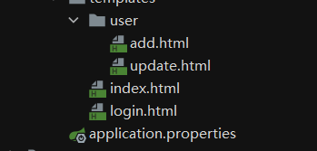

## SpringBoot-Shiro的使用方法

1.首先我们需要引入Spring-Shiro整合的依赖包

```xml
shiro-spring整合包-->
        <dependency>
            <groupId>org.apache.shiro</groupId>
            <artifactId>shiro-spring</artifactId>
            <version>1.9.0</version>

```

2.然后我们需要简单的搭建一个网页



3.编写网页间路由，代码都在Controller就不粘贴了

4.实现权限拦截与登录验证

* 4.1 我们首先需要在Shiro配置类中我们需要创建三个bean交给Spring来管理，这三个bean就是来进行Shiro的权限拦截，他会判断用户当前是否有设置的权限来控制用户是继续操作还是跳回登录页面。
  这三个bean分别为：xxxRealm，DefaultWebSecurityManager(需要setRealm)，ShiroFilterFactoryBean(需要setDefaultWebSecurityManager)，下一级的bean需要使用上一级的bean作为参数来注入自己的类属性，ShiroFilterFactoryBean这个bean则是我们设置权限验证与登录跳转的类，它可以通过LinkedHashMap来设置需要拦截的url以及设置setLoginUrl()来设置失败后跳转的页面。

```java
/**
 * 作为一个配置类，用来配置Shiro的一些必要的信息,使用配置类一定不要忘了添加注解
 * @author planifolia
 */
@Configuration
public class ShiroConfig {
    /**
     * ShiroFilterFactoryBean,需要shiroWebSecurityManager是它必须要设定的属性值,赋值完毕之后交给Spring处理<br>
     * 设置应用程序 SecurityManager 实例以供构造的 Shiro 过滤器使用。这是一个必需的属性
     * - 设置失败将引发初始化异常。
     */
    @Bean
    public ShiroFilterFactoryBean shiroFilterFactoryBean(@Qualifier("defaultWebSecurityManager") DefaultWebSecurityManager defaultWebSecurityManager){
        ShiroFilterFactoryBean bean=new ShiroFilterFactoryBean();
        bean.setSecurityManager(defaultWebSecurityManager);
        /**
         * tip：用户权限的类型
         * 1.anon，任何人
         * 2.authc，需要认证了
         * 3.user，需要记住我
         * 4.perms，需要拥有某个资源
         * 5.role，需要拥有某个角色
         */
        //我们在这里面进行用户的拦截
        //创建拦截的url以及对应的权限用户，用map来保存
        Map<String,String> filterMap=new LinkedHashMap<>();
        //设定user下的网页只有认证之后才能访问
        filterMap.put("/toupdate","authc");
        filterMap.put("/toadd","authc");
        //将属性放到ShiroFilterFactoryBean中
        bean.setFilterChainDefinitionMap(filterMap);
        bean.setLoginUrl("/toLogin");
        return bean;
    }
    /**
     * DefaultWebSecurityManager,它需要UserRealm作为参数，然后再将它当作bean交给Spring
     */
    @Bean
    public DefaultWebSecurityManager defaultWebSecurityManager(@Qualifier("userRealm") UserRealm userRealm){
        DefaultWebSecurityManager bean=new DefaultWebSecurityManager();
        bean.setRealm(userRealm);
        return bean;

    }
    /**
     * realm对象，只需要返回一个bean对象交给Spring容器就可以了
     */
    @Bean
    public UserRealm userRealm(){
        return new UserRealm();
    }
}


```

* 4.2 我们编写好配置类之后要开始编写处理登录信息的Controller,这个Controller会接收到前端的用户登录表单然后封装成token提交给shiro来进行下一步的处理

```java
    /**
     * 使用shiro来进行登陆验证的Controller
     * @param username
     * @param password
     * @param model
     * @return
     */
    @RequestMapping("/login")
    public String login(String username, String password, Model model){
        //获取当前用户
        Subject subject= SecurityUtils.getSubject();
        //封装用户的登录信息,令牌
        UsernamePasswordToken token=new UsernamePasswordToken(username,password);
        /*执行当前用户的登录操作，执行到这里之后shiro会交给UserRealm来完成剩下的验证操作，
        我们可以通过处理异常来给前端传递一些消息
        */
        try {
            subject.login(token);
            return "index";
        }catch (UnknownAccountException unknownAccountException){//处理用户不存在异常
            model.addAttribute("msg","用户名不存在！");
            return "/login";
        }catch (IncorrectCredentialsException incorrectCredentialsException){//处理密码不正确异常
            model.addAttribute("msg","用户密码错误！");
            return "login";
        }
```

* 4.3 当controller将信息封装好并且交给shiro之后我们就要开始编写xxxRealm类了，这个类会根据提交过来的token来进行验证，根据我们编写的代码以及调用shiro里面的验证密码的方法来返回不同的异常，这个异常就需要我们在controller中处理

```java
/**
 * @author 14431
 */
public class UserRealm extends AuthorizingRealm {
    /**
     * 授权
     */
    @Override
    protected AuthorizationInfo doGetAuthorizationInfo(PrincipalCollection principalCollection) {
        System.out.println("Shiro授权方法执行");
        return null;
    }

    /**
     * 认证
     */
    @Override
    protected AuthenticationInfo doGetAuthenticationInfo(AuthenticationToken authenticationToken) throws AuthenticationException {
        System.out.println("Shiro认证方法执行");
        String name="user";
        String pass="001";
        //拿到controller送过来的token并且强转型
        UsernamePasswordToken token=(UsernamePasswordToken) authenticationToken;
        //如果token的用户名与我们的不一致则返回null
        if(!token.getUsername().equals(name)){
            return null;
        }
        //密码认证，只能交给shiro来做
        return new SimpleAuthenticationInfo("",pass,"");
    }
}
```
